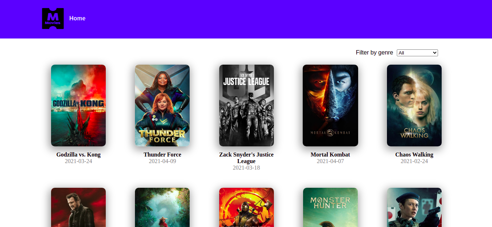

# Movies Catalogue
 

This a Movies Catalogue website where you can find some of the best movies of the moment and information about it.

## Built With

- Npm
- React
- Redux
- HTML5
- CSS3
- [The Movie Database API](https://www.themoviedb.org/)
- [react-circular-progressbar](https://www.npmjs.com/package/react-circular-progressbar)

## Live Demo

[Live Demo Link](https://movies-cataloguejosepedraza.herokuapp.com/)

## Getting Started

This is a Movies Catalogue App where you can find some of the movies at the moment, also you can filet it by genre.

To get a local copy up and running follow these simple example steps.

### Prerequisites
- [Node.js](https://nodejs.org/en/) 
- git
### Setup
Clone the repo with the command:

> git clone https://github.com/pastorp3/MoviesCatalogue.git

### Install
Open the project folder and install of the dependencies with:

> npm install 

### Usage

Run the app on the your local browser:

> npm start

## Authors

👤 **José Pedraza**

- Github: [@pastorp3](https://github.com/pastorp3)
- Twitter: [@jose_pastor](https://twitter.com/jose_pastorp3 )
- Linkedin: [linkedin](https://www.linkedin.com/in/jos%C3%A9-pedraza-acevedo-ab700a1a9/)

## 🤝 Contributing

Contributions, issues, and feature requests are welcome!

Feel free to check the [issues page](issues/).

## Show your support

Give a ⭐️ if you like this project!

## Acknowledgments

- Hat tip to anyone whose code was used
- Inspiration
- etc

## 📝 License

This project is [MIT](lic.url) licensed.